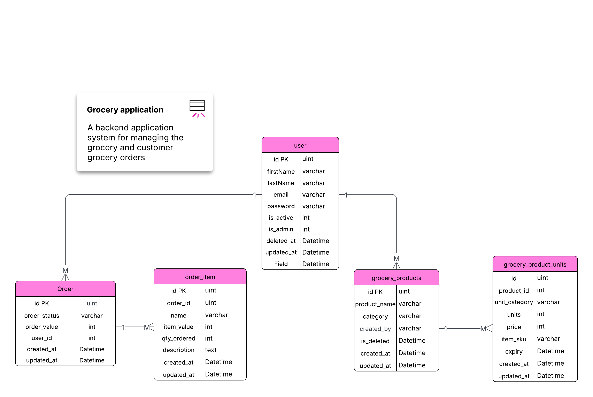

# FreshKart

A backend application system for managing the grocery and customer grocery orders

## Database schema



## API Reference

### Visit the API at

    https://qp-assessment-t9bn.onrender.com/v1/ping

### Customer Route

#### Create order

```http
  POST /v1/customer/order
```

| Payload         | Type           | Description                         |
|:----------------|:---------------|:------------------------------------|
| `user_id`       | `number`       | User id                             |
| `cart`          | `Array`        | Cart containing the items and units |
| `product_units` | `Array[Units]` | Array of grocery units              |

### Admin routes

#### Get all products

```http
  GET /v1/products
```

| Query Parameter | Type     | Description                 |
|:----------------|:---------|:----------------------------|
| `limit`         | `number` | **Optional**. Product limit |
| `page`          | `number` | **Optional**. Pagination    |

#### Create product

```http
  POST /v1/products
```

| Payload         | Type           | Description            |
|:----------------|:---------------|:-----------------------|
| `product_name`  | `string`       | Product name           |
| `category`      | `string`       | Product category       |
| `product_units` | `Array[Units]` | Array of grocery units |

##### Units

| Payload         | Type     | Description                       |
|:----------------|:---------|:----------------------------------|
| `item_sku`      | `string` | Item sku for identification       |
| `unit_category` | `string` | Item category (eg: 1kg or 500gms) |
| `units`         | `Float`  | Number of units                   |
| `price`         | `Float`  | Price of the item                 |
| `expiry`        | `Date`   | Expiry date of the item           |

#### Update product

```http
  PUT /v1/products/:product_id
```

For creating or updating the product the payload is same for updating we need to specify the product_id

#### Delete product

```http
  DELETE /v1/products/:product_id
```

#### Sample cURL Request for getting the product

### With limit and offset

```sh
curl --request GET \
  --url 'https://qp-assessment-t9bn.onrender.com/v1/products?limit=10&page=1' \
  --header 'content-type: application/json'
```

### Using product name filter

```sh
curl --request GET \
  --url https://qp-assessment-t9bn.onrender.com/v1/products \
  --header 'content-type: application/json' \
  --data '{
 "product_name" :"Frozen Pizza"
}'
```

